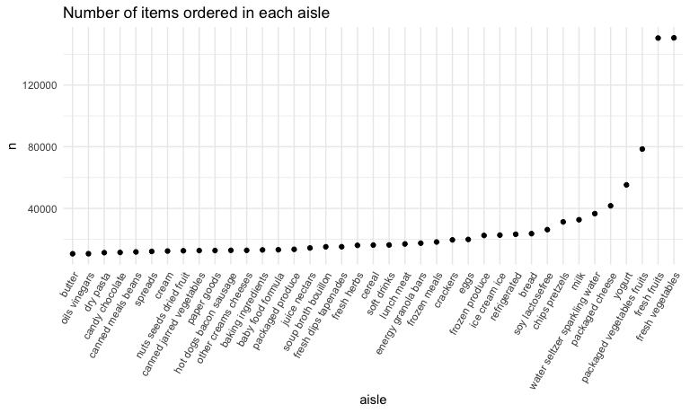

p8105_hw3_yl5227
================
Jennifer Li
2023-10-12

# Problem 1

Load `Instacart` data

``` r
library(p8105.datasets)
data("instacart")

instacart = as_tibble(instacart)
```

## short description of the dataset

This dataset contains 1384617 rows and 15 columns. It encompasses a
range of crucial variables, including customer identifiers, product
information, such as *order id*, *user id*, *product name*.

## How many aisles are there, and which aisles are the most items ordered from?

``` r
instacart |> 
  select(aisle) |> 
  distinct() |> 
  count()
```

    ## # A tibble: 1 × 1
    ##       n
    ##   <int>
    ## 1   134

``` r
instacart |> 
  count(aisle)  |> 
  arrange(desc(n)) |> 
  pull(aisle) |> 
  first() |> 
  print()
```

    ## [1] "fresh vegetables"

There are 134 aisles, and the most items ordered from fresh vegetables
aisle.

## Make a plot that shows the number of items ordered in each aisle, limiting this to aisles with more than 10000 items ordered. Arrange aisles sensibly, and organize your plot so others can read it.

``` r
instacart |> 
  count(aisle) |> 
  filter(n > 10000) |> 
  mutate(aisle = fct_reorder(aisle, n)) |> 
  ggplot(aes(x = aisle, y = n)) +
  geom_point() +
  labs(title = "Number of items ordered in each aisle") +
  theme(axis.text.x = element_text(angle = 60, hjust = 1))
```



The plot shows the number of items ordered in aisle with more than 10000
items ordered in an increasing order. The top two most popular aisle are
fresh vegetables and fresh fruits.

## Make a table showing the three most popular items in each of the aisles “baking ingredients”, “dog food care”, and “packaged vegetables fruits”. Include the number of times each item is ordered in your table.

``` r
instacart |> 
  filter(aisle %in% c("baking ingredients", "dog food care", "packaged vegetables fruits")) |> 
  select(product_name, aisle) |> 
  group_by(aisle) |> 
  count(product_name) |> 
  mutate(rank = min_rank(desc(n))) |> 
  filter(rank < 4) |> 
  arrange(aisle, rank) |> 
  knitr::kable()
```

| aisle                      | product_name                                  |    n | rank |
|:---------------------------|:----------------------------------------------|-----:|-----:|
| baking ingredients         | Light Brown Sugar                             |  499 |    1 |
| baking ingredients         | Pure Baking Soda                              |  387 |    2 |
| baking ingredients         | Cane Sugar                                    |  336 |    3 |
| dog food care              | Snack Sticks Chicken & Rice Recipe Dog Treats |   30 |    1 |
| dog food care              | Organix Chicken & Brown Rice Recipe           |   28 |    2 |
| dog food care              | Small Dog Biscuits                            |   26 |    3 |
| packaged vegetables fruits | Organic Baby Spinach                          | 9784 |    1 |
| packaged vegetables fruits | Organic Raspberries                           | 5546 |    2 |
| packaged vegetables fruits | Organic Blueberries                           | 4966 |    3 |

This table shows the three most popular items in aisles
`baking ingredients`, `dog food care`, and `packaged vegetables fruits`
from the most to the least popular items among the three most popular
items.

## Make a table showing the mean hour of the day at which Pink Lady Apples and Coffee Ice Cream are ordered on each day of the week; format this table for human readers (i.e. produce a 2 x 7 table)

``` r
instacart |> 
  filter(product_name %in% c("Pink Lady Apples", "Coffee Ice Cream")) |>
  select(order_hour_of_day, product_name, order_dow) |> 
  group_by(product_name, order_dow) |> 
  summarize(mean_hour = mean(order_hour_of_day)) |> 
  pivot_wider(
    names_from = order_dow,
    values_from = mean_hour
  ) |> 
  knitr::kable(digits = 2)
```

    ## `summarise()` has grouped output by 'product_name'. You can override using the
    ## `.groups` argument.

| product_name     |     0 |     1 |     2 |     3 |     4 |     5 |     6 |
|:-----------------|------:|------:|------:|------:|------:|------:|------:|
| Coffee Ice Cream | 13.77 | 14.32 | 15.38 | 15.32 | 15.22 | 12.26 | 13.83 |
| Pink Lady Apples | 13.44 | 11.36 | 11.70 | 14.25 | 11.55 | 12.78 | 11.94 |

This table shows mean hour of the day at which Pink Lady Apples and
Coffee Ice Cream are ordered on each day of the week.

# Problem 2

Load `BRFSS` data.

``` r
data("brfss_smart2010")

brfss = as_tibble(brfss_smart2010)
```

Clean this dataset

- Use `janitor::clean_names()` to clean the variable names

- Use `filter()` to subset the data of “Overall Health” topic

- Order `response` variable from *Poor* to *Excellent*

``` r
brfss =
  brfss |> 
  janitor::clean_names() |> 
  filter(topic == "Overall Health") |> 
  mutate(response = fct_relevel(response, "Poor", "Fair", "Good", "Very good", "Excellent"))
```
