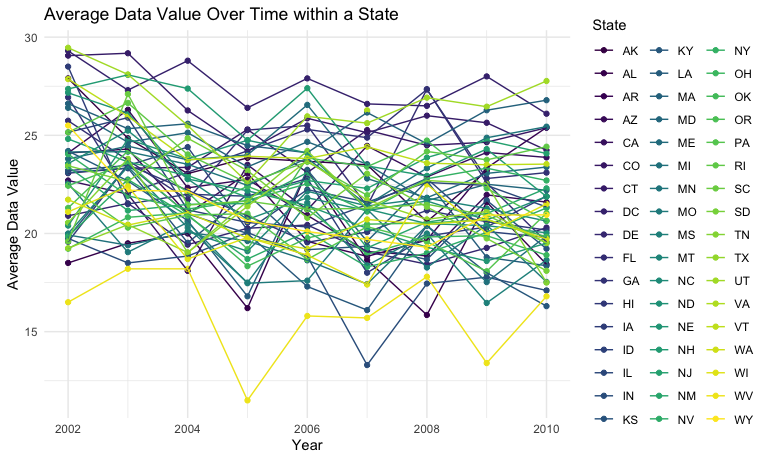

p8105_hw3_yl5227
================
Jennifer Li
2023-10-12

# Problem 1

Load `Instacart` data

``` r
library(p8105.datasets)
data("instacart")

instacart = as_tibble(instacart)
```

*Short description of the dataset*

This dataset contains 1384617 rows and 15 columns. It encompasses a
range of crucial variables, including customer identifiers, product
information, such as *order id*, *user id*, *product name*.

*How many aisles are there, and which aisles are the most items ordered
from?*

``` r
instacart |> 
  select(aisle) |> 
  distinct() |> 
  count()
```

    ## # A tibble: 1 × 1
    ##       n
    ##   <int>
    ## 1   134

``` r
instacart |> 
  count(aisle)  |> 
  arrange(desc(n)) |> 
  pull(aisle) |> 
  first() |> 
  print()
```

    ## [1] "fresh vegetables"

There are 134 aisles, and the most items ordered from fresh vegetables
aisle.

**Make a plot that shows the number of items ordered in each aisle,
limiting this to aisles with more than 10000 items ordered. Arrange
aisles sensibly, and organize your plot so others can read it.**

``` r
instacart |> 
  count(aisle) |> 
  filter(n > 10000) |> 
  mutate(aisle = fct_reorder(aisle, n)) |> 
  ggplot(aes(x = aisle, y = n)) +
  geom_point() +
  labs(title = "Number of items ordered in each aisle") +
  theme(axis.text.x = element_text(angle = 60, hjust = 1))
```


The plot shows the number of items ordered in aisle with more than 10000
items ordered in an increasing order. The top two most popular aisle are
fresh vegetables and fresh fruits.

**Make a table showing the three most popular items in each of the
aisles “baking ingredients”, “dog food care”, and “packaged vegetables
fruits”. Include the number of times each item is ordered in your
table.**

``` r
instacart |> 
  filter(aisle %in% c("baking ingredients", "dog food care", "packaged vegetables fruits")) |> 
  select(product_name, aisle) |> 
  group_by(aisle) |> 
  count(product_name) |> 
  mutate(rank = min_rank(desc(n))) |> 
  filter(rank < 4) |> 
  arrange(aisle, rank) |> 
  knitr::kable()
```

| aisle                      | product_name                                  |    n | rank |
|:---------------------------|:----------------------------------------------|-----:|-----:|
| baking ingredients         | Light Brown Sugar                             |  499 |    1 |
| baking ingredients         | Pure Baking Soda                              |  387 |    2 |
| baking ingredients         | Cane Sugar                                    |  336 |    3 |
| dog food care              | Snack Sticks Chicken & Rice Recipe Dog Treats |   30 |    1 |
| dog food care              | Organix Chicken & Brown Rice Recipe           |   28 |    2 |
| dog food care              | Small Dog Biscuits                            |   26 |    3 |
| packaged vegetables fruits | Organic Baby Spinach                          | 9784 |    1 |
| packaged vegetables fruits | Organic Raspberries                           | 5546 |    2 |
| packaged vegetables fruits | Organic Blueberries                           | 4966 |    3 |

This table shows the three most popular items in aisles
`baking ingredients`, `dog food care`, and `packaged vegetables fruits`
from the most to the least popular items among the three most popular
items.

**Make a table showing the mean hour of the day at which Pink Lady
Apples and Coffee Ice Cream are ordered on each day of the week; format
this table for human readers (i.e. produce a 2 x 7 table)**

``` r
instacart |> 
  filter(product_name %in% c("Pink Lady Apples", "Coffee Ice Cream")) |>
  select(order_hour_of_day, product_name, order_dow) |> 
  group_by(product_name, order_dow) |> 
  summarize(mean_hour = mean(order_hour_of_day)) |> 
  pivot_wider(
    names_from = order_dow,
    values_from = mean_hour
  ) |> 
  knitr::kable(digits = 2)
```

    ## `summarise()` has grouped output by 'product_name'. You can override using the
    ## `.groups` argument.

| product_name     |     0 |     1 |     2 |     3 |     4 |     5 |     6 |
|:-----------------|------:|------:|------:|------:|------:|------:|------:|
| Coffee Ice Cream | 13.77 | 14.32 | 15.38 | 15.32 | 15.22 | 12.26 | 13.83 |
| Pink Lady Apples | 13.44 | 11.36 | 11.70 | 14.25 | 11.55 | 12.78 | 11.94 |

This table shows mean hour of the day at which Pink Lady Apples and
Coffee Ice Cream are ordered on each day of the week.

# Problem 2

Load `BRFSS` data.

``` r
data("brfss_smart2010")

brfss = as_tibble(brfss_smart2010)
```

Clean this dataset

- Use `janitor::clean_names()` to clean the variable names

- Use `filter()` to subset the data of “Overall Health” topic

- Order `response` variable from *Poor* to *Excellent*

``` r
brfss =
  brfss |> 
  janitor::clean_names() |> 
  filter(topic == "Overall Health") |> 
  mutate(response = fct_relevel(response, "Poor", "Fair", "Good", "Very good", "Excellent"))
```

There are a total of 23 variables. There are 10625 rows and 23 columns.

*In 2002, which states were observed at 7 or more locations? What about
in 2010?*

``` r
state_location_2002 =
  brfss |> 
  filter(year == 2002) |> 
  group_by(locationabbr) |> 
  distinct(locationdesc) |> 
  count(locationabbr) |> 
  filter(n >= 7) |> 
  print()
```

    ## # A tibble: 6 × 2
    ## # Groups:   locationabbr [6]
    ##   locationabbr     n
    ##   <chr>        <int>
    ## 1 CT               7
    ## 2 FL               7
    ## 3 MA               8
    ## 4 NC               7
    ## 5 NJ               8
    ## 6 PA              10

``` r
state_location_2010 =
  brfss |> 
  filter(year == 2010) |> 
  group_by(locationabbr) |> 
  distinct(locationdesc) |> 
  count(locationabbr) |> 
  filter(n >= 7) |> 
  print()
```

    ## # A tibble: 14 × 2
    ## # Groups:   locationabbr [14]
    ##    locationabbr     n
    ##    <chr>        <int>
    ##  1 CA              12
    ##  2 CO               7
    ##  3 FL              41
    ##  4 MA               9
    ##  5 MD              12
    ##  6 NC              12
    ##  7 NE              10
    ##  8 NJ              19
    ##  9 NY               9
    ## 10 OH               8
    ## 11 PA               7
    ## 12 SC               7
    ## 13 TX              16
    ## 14 WA              10

In 2002, CT, FL, MA, NC, NJ and PA were observed 7 or more locations. In
2010, CA, CO, FL, MA, MD, NC, NE, NJ, NY, OH, PA, SC, TX, WA were
observed at 7 or more locations.

*Construct a dataset that is limited to Excellent responses, and
contains, year, state, and a variable that averages the data_value
across locations within a state. Make a “spaghetti” plot of this average
value over time within a state (that is, make a plot showing a line for
each state across years – the geom_line geometry and group aesthetic
will help).*

The `brfss_excel` dataset is limited *Excellent* responses, and contains
year, state, and a variable that averages the data_value across
locations within a state.

``` r
brfss_excel =
  brfss |> 
  filter(response == "Excellent") |> 
  group_by(year, locationabbr) |> 
  summarize(avg_data_value = mean(data_value, na.rm = TRUE))
```

    ## `summarise()` has grouped output by 'year'. You can override using the
    ## `.groups` argument.

``` r
brfss_excel             
```

    ## # A tibble: 443 × 3
    ## # Groups:   year [9]
    ##     year locationabbr avg_data_value
    ##    <int> <chr>                 <dbl>
    ##  1  2002 AK                     27.9
    ##  2  2002 AL                     18.5
    ##  3  2002 AR                     24.1
    ##  4  2002 AZ                     24.1
    ##  5  2002 CA                     22.7
    ##  6  2002 CO                     23.1
    ##  7  2002 CT                     29.1
    ##  8  2002 DC                     29.3
    ##  9  2002 DE                     20.9
    ## 10  2002 FL                     25.7
    ## # ℹ 433 more rows

There are a total of 3 variables. There are 443 rows and 3 columns.

Create the plot for `brfss_excel`.

``` r
ggplot(brfss_excel, 
       aes(x = year, y = avg_data_value, 
           group = locationabbr, 
           color = locationabbr)) +
  geom_point() + 
  geom_line() +
  labs(
    title = "Average Data Value Over Time within a State",
    x = "Year",
    y = "Average Data Value",
    color = "State"
  ) +
  theme_minimal()
```



This plot shows the average data value over time within each state,
limited to “Excellent” response. There are a total of 51 states
observed. To make the plot more readable, the legends indicating `state`
have been placed on the side of the plot, with the x-axis representing
the `year`, and the y-axis representing the `average data value`. The
`average data value` fluctuates by `year` for most states.

*Make a two-panel plot showing, for the years 2006, and 2010,
distribution of data_value for responses (“Poor” to “Excellent”) among
locations in NY State.*

``` r
ny_2006_2010 =
  brfss |>
  filter(locationabbr == "NY", 
         year %in% c(2006, 2010)) |>
  separate(locationdesc, into = c("state", "county"), "-") |>
  select(year, county, response, data_value) |>
  ggplot(aes(x = response, y = data_value)) +
  geom_boxplot() +
  geom_point(aes(color = county)) +
  facet_grid(~ year) +
  labs(title = "Data Value distribution in Responses among NY locations (in 2006 and 2010)",
       x = "Response",
       y = "Data Value",
       color = "County") +
  theme_minimal()

ny_2006_2010
```


`ny_2006_2010` is a plot that contains `brfss` that filters out only New
York and years *2006* or *2010* data values. The above is a two panel
plot showing, for the years 2006 and 2010, the distribution of the
*data_value* for responses (“Poor” to “Excellent”) among locations in
New York State. The plot shows smililar distribution of *data_value* for
responses among locations in NY locations. In `2006`, `Good` and
`Very good` responses are high in terms of mean `data value`. In `2010`,
`Very good` response has the highest mean `data value`.

# Problem 3

Import dataset `nhanes_accel.csv` and `nhanes_covar.csv`, and clean
variable names of these datasets.

``` r
df_nhanes_accel =
  read_csv("data/nhanes_accel.csv") |> 
  janitor::clean_names()
```

    ## Rows: 250 Columns: 1441
    ## ── Column specification ────────────────────────────────────────────────────────
    ## Delimiter: ","
    ## dbl (1441): SEQN, min1, min2, min3, min4, min5, min6, min7, min8, min9, min1...
    ## 
    ## ℹ Use `spec()` to retrieve the full column specification for this data.
    ## ℹ Specify the column types or set `show_col_types = FALSE` to quiet this message.

``` r
df_nhanes_covar =
  read_csv("data/nhanes_covar.csv", skip = 4) |> 
  janitor::clean_names()
```

    ## Rows: 250 Columns: 5
    ## ── Column specification ────────────────────────────────────────────────────────
    ## Delimiter: ","
    ## dbl (5): SEQN, sex, age, BMI, education
    ## 
    ## ℹ Use `spec()` to retrieve the full column specification for this data.
    ## ℹ Specify the column types or set `show_col_types = FALSE` to quiet this message.

Data wrangling of `df_nhanes_covar` and `df_nhanes_accel`.

- Recode sex and education.

- Change sex and education to factor variables.

``` r
df_nhanes_covar =
df_nhanes_covar |> 
  mutate(sex = case_match( sex,
        1 ~ "Male",
        2 ~ "Female"),
    education = case_match(education,
        1 ~ "less than high school",
        2 ~ "high school equivalent",
        3 ~ "more than high school"),
    education = as.factor(education),
    sex = as.factor(sex),)

df_nhanes_accel =
  df_nhanes_accel |> 
  pivot_longer(
    min1:min1440,
    names_prefix = "min",
    names_to = "time_minute",
    values_to = "mims_value")
```

Merge `df_nhanes_covar` and `df_nhanes_accel` and clean merged dataset.
Filter out participants that are under 21 and exclude NAs.

``` r
df_merged =
  merge(df_nhanes_covar, df_nhanes_accel, by = "seqn") |> 
  filter(age >= 21) |> 
  drop_na()
```

The `df_merged` merges `df_nhanes_covar` and `df_nhanes_accel`
dataframes. It has 328320 rows and 7 columns.
